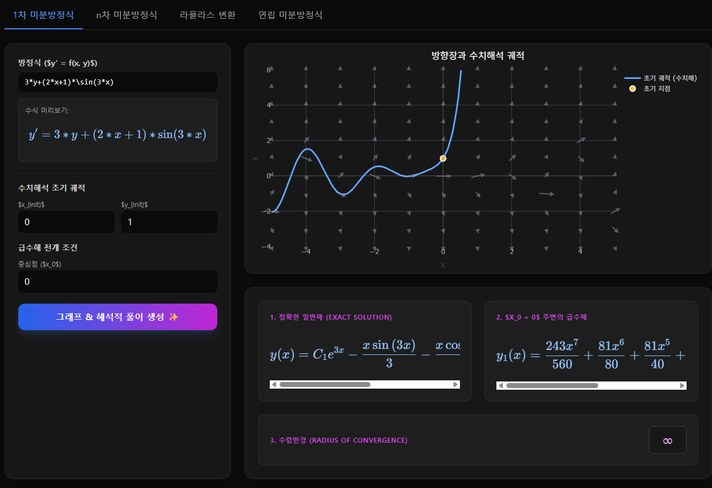
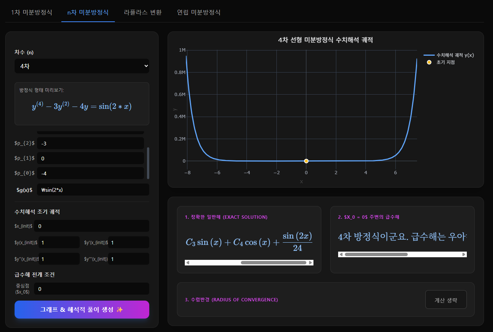
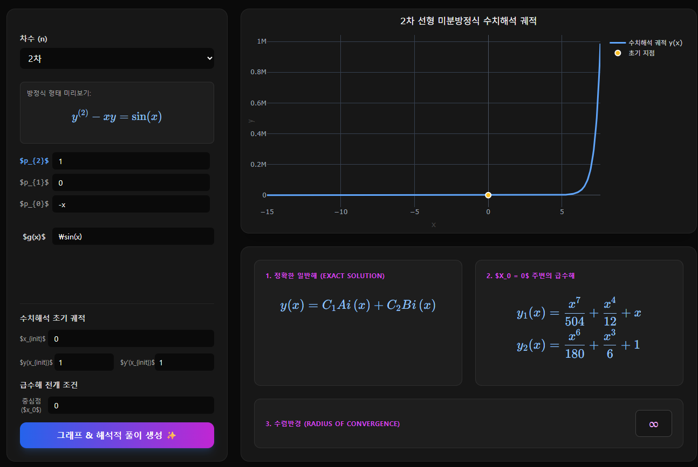
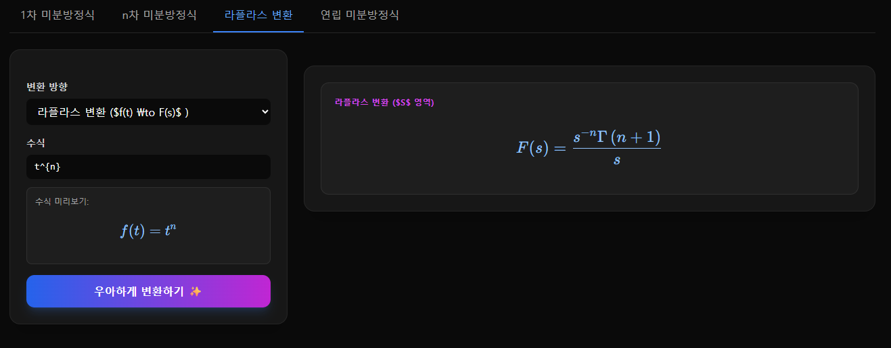
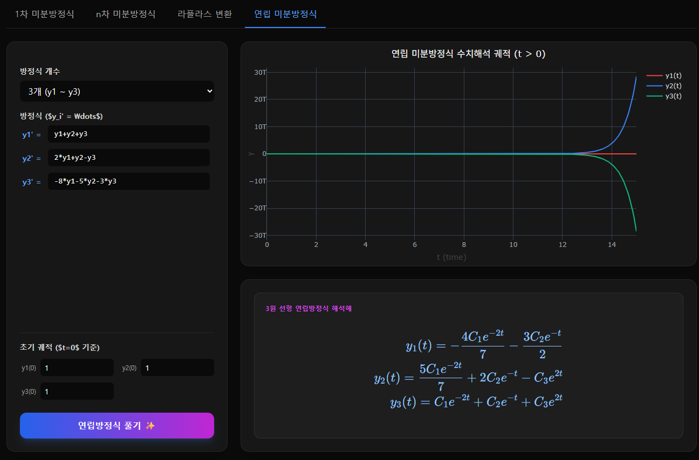

## ODE(Ordinary Differential Equation) Solver란?

공통적으로, 주어진 Initial Condition에 대한 Graph를 제공합니다.  
1st-Order Differential Equation에 대한 Direction Field, Series Expansion, 그리고 General Solution을 제공합니다.  
2nd-Order Differential Equation에 대한 General Solution, Corresponding Homogeneous Equation에 대한 Series Expansion을 제공합니다.  
3차 ~ 6차의 High-Order Differential Equation에 대한 General Solution을 제공하지만, 계수가 지수함수나 삼각함수일 경우 제공하지 못 할 가능성이 큽니다. (일반적으로, 이는 Constant Coefficient를 갖는 방정식에 대한 기능입니다.)  

**즉, 일반적으로 학부 수준에서 다루는 Boyce's 미분방정식 교재의 1장~7장을 공부할 때 도움이 되는 프로그램입니다.**

 
공부하다가 열 받아서 내가 만들었습니다.

### 사용 예시: 
Example 1. $y'-3y=(2x+1)\sin(3x), \ y(0)=1$의 Solution을 구하는 과정
 
\
Example 2. $y^{(4)}-3y''-4y=\sin(2x), \ y^{(3)}(0)=1, y''(0)=1, y'(0)=1. y(0)=1$의 Solution을 구하는 과정
 
\
Example 3. Airy Equation의 Series Expantion을 구하는 과정
 
\
Example 4. $f(t)=t^{n}$의 Laplace Transform을 구하는 과정
 
\
Example 5. Linear Differential Equation System의 Solution을 구하는 과정
 
\
 

### 실행 방법: 
압축을 풀어 ODE_Solver.exe 파일을 실행합니다. (사용법을 따로 .txt로 첨부하였습니다.)  
CMD 콘솔 창이 켜져 있는 상태에서, `http://172.0.0.1:5000`으로 웹 접속하면 사용할 수 있습니다.  
콘솔을 끄지 않는다면(혹은 CTRL+C로 인터럽트를 주지 않는다면) 위의 링크로 접속 가능하며, 콘솔을 끄면 완전히 꺼집니다.  

 

### 참고:
$\LaTeX$의 수식과 `sympy`의 수식 표현 기법이 혼용됩니다.  
Nonlinear 1st-Order Differential Equation에 대해서, General Solution을 억지로 가능한 만큼 explict한 형태로 출력하므로, implict한 형태가 필요하다면 직접 계산해야 합니다.
